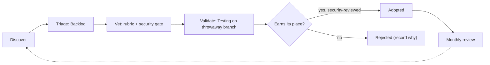

# Lesson 0.10 — Tooling R&D, validation & selection (ongoing practice)

**Date:** 2026-07-26   **Module:** 0   **WAF pillar(s):** Operational Excellence   **Token cost:** negligible (process/docs)   **Status:** ✅ Done (process established; runs continuously)

## What we did
Turned "picking tools" from a one-off into a **repeatable capability**. Lessons 0.2 (plugins),
0.3 (MCP servers) and 0.9 (CLIs) are the *first pass*; this lesson defines the loop that governs
them and keeps running for the life of this and future projects. We also built the living tracker
(a Notion database + `docs/tooling-decisions.md`) and seeded it.

## Why this tool / resource
Tools are dependencies: they carry cost, maintenance and — for community plugins — real security
surface (hooks, MCP servers, code that runs on your machine). Adopting deliberately and reviewing
periodically is Operational Excellence, and it's the most portable habit to carry to future
projects.

## The loop
1. **Discover** — official `/plugin marketplace`; GitHub signals (stars, last commit, open issues);
   community roundups *read skeptically* — marketing inflates, so verify claims.
2. **Triage** — add each candidate to the R&D tracker as `Backlog`.
3. **Vet** — score on the rubric (need · fit · learning · cost · reversibility) **+ a security
   gate**: for community plugins, read the hooks/MCP/code and check the maintainer first.
   **Official (Anthropic) ≠ community — that's the safety line.**
4. **Validate** — move to `Testing`; try on a throwaway branch/project before any global install.
5. **Select** — promote to `Adopted` only once *Security-reviewed* is ticked; else `Rejected`.
   Record the *why* either way.
6. **Review on cadence** — ~30-min monthly sweep; drop adopted tools that stop earning their keep.

## Pros / Cons
| Pros | Cons |
|---|---|
| Stops tool sprawl and unvetted third-party code | A little upfront process discipline |
| Reasoning is captured and reusable across projects | Needs a periodic sweep to stay current |
| Security gate catches risky community plugins early | "Popular" ≠ safe — still must read the code |

## Alternatives considered (and why not)
- **Install whatever looks cool** — how you end up running unvetted code and drowning in half-used
  plugins. Rejected.
- **Never use community tools** — safe but misses real wins (e.g. cross-session memory). The gate
  lets you say yes *carefully* instead of no by default.

## FAQs captured this lesson
> **Q (you):** Which lesson do we R&D, check, validate and select tools in?
> **A:** This one (0.10) defines the ongoing loop; 0.2/0.3/0.9 are its first pass. The living
> home is the "Claude Skills & Plugins (R&D)" Notion database + `docs/tooling-decisions.md`.

## Evidence / links
- Tracker (repo): `docs/tooling-decisions.md`
- Tracker (Notion): "Claude Skills & Plugins (R&D)" database (under Claude Tips)
- Rubric + method: Module 0 intro of the plan ("workshop, don't prescribe")
- Related: [[Lesson 0.2]] plugins · [[Lesson 0.3]] MCP · [[Lesson 0.9]] CLIs
