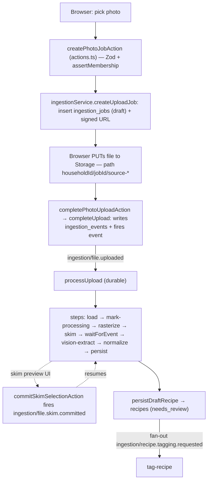

# Lesson 1.1 — Read a codebase by its seams

**Skills in play:** none (reading/tracing exercise). Method feeds every later module — you must know the seams before you swap one.

**Date:** 2026-07-27   **Module:** 1   **WAF pillar(s):** Operational Excellence   **Token cost:** negligible (reading)   **Status:** ✅ Done

## What we did
Instead of reading the app top-to-bottom, we found its **seams** (where control passes between
layers) and traced *one* feature — recipe import — across them. Learn the seams once and every
feature becomes "which layers does it touch?".

## The seams (each is a directory)
| Seam | Directory | Rule it obeys |
|---|---|---|
| Route / Server Action | `app/(app)/…/actions.ts` | validate + delegate only, no business logic |
| Domain service | `lib/services/` | typed args; owns the DB writes |
| **Event boundary** (sync → async) | `lib/inngest/client.ts` | ids-only payloads |
| Durable pipeline | `lib/inngest/functions/` | every step idempotent (replay-safe) |

## Import traced end-to-end (photo path)

## What the trace reveals
1. **Route layer is thin by rule.** `createPhotoJobAction` = parse → check membership → delegate →
   return `{ ok }`. All three import kinds (photo/URL/Drive) converge on **one event**,
   `ingestion/file.uploaded`.
2. **The event is the key seam** — where a fast HTTP request ends and durable, retryable work
   begins. Follow `inngest.send(...)` → `{ event: ... }` to cross it.
3. **The pipeline loops back into the UI.** It pauses on `step.waitForEvent("await-skim-selection")`;
   a server action (`commitSkimSelectionAction`) fires the resume event when the user picks recipes.
   That durable-job → route → durable-job round-trip is the app's most important pattern — Module 6
   must preserve it on Durable Functions.

## FAQs captured this lesson
> **Q (you):** _(none yet)_

## Evidence / links
- `app/(app)/recipes/import/actions.ts` (route) · `lib/services/ingestion-service.ts` (domain)
- `lib/inngest/client.ts` (event catalog) · `lib/inngest/functions/process-upload.ts` (pipeline)
- `lib/ingestion/persist-recipe.ts` (persistence)
- Related: [Lesson 1.4](01-4-database-decision.md) (the DB these writes land in).
